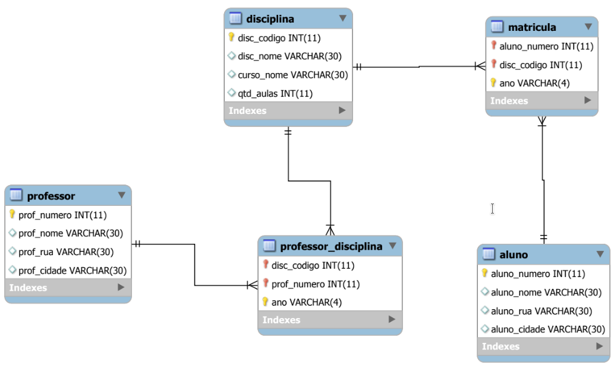

<h1>Exercício - Função de Agrupamento</h1>

1. Crie uma consulta com todas as disciplinas oferecidas no ano de 2018, constando os nomes das disciplinas, nomes e cidades dos professores responsáveis e nomes dos cursos das disciplinas.

2. Crie uma consulta que mostre todos os nomes dos professores do curso de CST Sistemas para Internet, no ano de 2018, e os nomes das disciplinas pelas quais são responsáveis.

3. Crie uma consulta com todos os nomes de alunos matriculados no ano de 2018, os nomes das disciplinas em que estão matriculados, a cidade onde moram e os nomes dos cursos das disciplinas.

4. Crie uma consulta que mostre todos os alunos de Palmas que cursam alguma disciplina de Programação de Banco de dados no ano de 2018.

5. Crie uma consulta que mostre todos os professores que não moram em Palmas e que ministram alguma disciplina no curso de CST Sistemas para Internet.

6. Crie uma consulta que mostre o nome dos professores e a média de aulas que ministram.

7. Crie uma consulta que mostre o nome dos professores o total de aulas que ministram por curso.

8. Crie uma consulta que mostre o nome do aluno, nome do curso, código e nome das disciplinas matriculadas de todos os alunos no ano de 2018.

Data: 26 de fevereiro de 2024 (2024-02-26).
