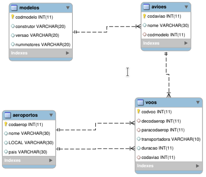

<h1>Exercício - Consultas</h1>

1. Liste o local e o nome de todos os aeroportos de Portugal (local, nome).

2. Liste os nomes de todos os aviões da versão DC-10 (nome).

3. Liste para cada avião, a quantidade de motores necessários (nome_avião, num_motores).

4. Quantos voos com a duração de 2 ou 3 horas há no sistema (contagem) ?

5. Liste todos os modelos de avião da série A3xx , isto é, em que a versão começa pelo texto A3 (versão).

6. Liste os códigos de todos os voos ordenados por duração, voos mais compridos primeiro; para o caso de voos de igual duração, ordene crescentemente pelo código do vôo (codvoo, duração).

7. Tendo em conta que não existe nenhum voo direto do aeroporto de código 1 (Porto) para o aeroporto de código 12 (Londres), liste todos as escalas possíveis (cód_voo1,cód_voo2, código_aeroporto_da_escala). Sugestão: Utilize os códigos dos aeroportos (1 e 12) na pesquisa.

8. Quantos aeroportos há por país ordene a resposta por ordem decrescente (país, contagem)?

9. Liste ordenadamente todos os voos, respectivo local de origem e local de destino, ordenando pelo código de voo crescente (codvoo, de_local, para_local). Apresente as colunas como Código do Voo , Origem e Destino.

10.	Liste os códigos dos voos de Porto para Lisboa (codvoo) ? Atenção: A pesquisa não se pode basear nos atuais códigos de aeroportos, e deve funcionar mesmo se os códigos de aeroportos mudarem.

11.	Conte o número de aeroportos por país (país, contagem); mostre apenas os países com mais de 2 aeroportos.

12. Qual o país, ou países, com mais aeroportos e com quantos aeroportos ? (país, contagem)

13. Liste para cada voo, qual o nome do aeroporto de partida e de chegada (cod_voo, nome_aerop_part, nome_aerop_cheg); ordene a resposta alfabeticamente pelo nome do aeroporto de partida e depois pelo nome do aeroporto de chegada.

14.	Liste para cada modelo, quantos aviões realmente existem. Ordene a listagem tal forma que os modelos mais frequentes apareçam em último lugar (construtor, versão, contagem). Omita da listagem aviões com contagem nula.

15.	Liste para cada modelo, quantos aviões realmente existem. Ordene a listagem tal forma que os modelos mais frequentes apareçam em último lugar (construtor, versão, contagem). Inclua na listagem aviões com contagem nula.

Data: 04 de março de 2024 (2024-03-04).
